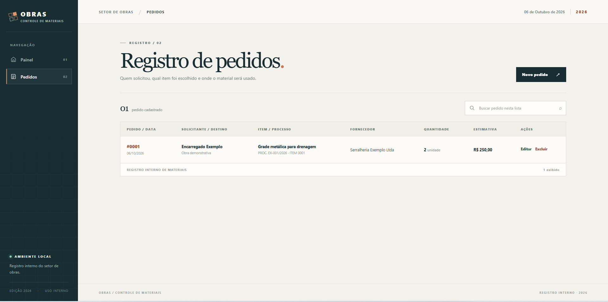
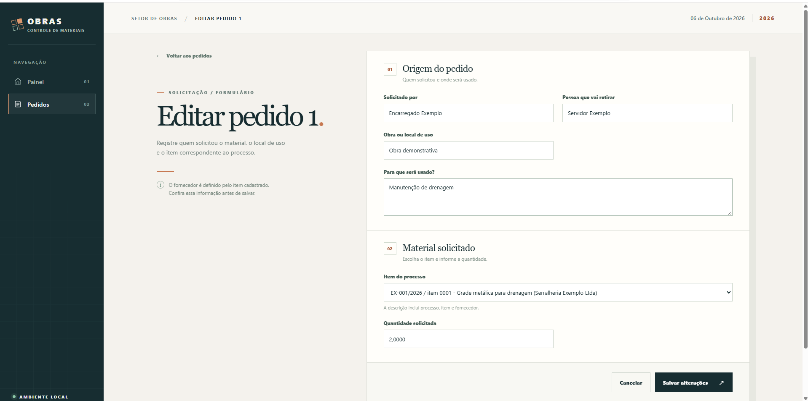

# Entrega da Semana 2

## Checklist

- [x] Dashboard inicial consulta dados do banco.
- [x] Quatro models de domínio e relações 1:N.
- [x] CRUD completo da entidade principal `Pedido`.
- [x] Listar pedidos.
- [x] Cadastrar pedido.
- [x] Editar pedido.
- [x] Excluir pedido mediante confirmação.
- [x] Ambiente virtual local e `requirements.txt` no repositório.
- [x] Dados fictícios reproduzíveis com fixture do Django.
- [x] Views em funções, `ModelForm` e ORM do Django.

## Capturas da funcionalidade

As imagens abaixo mostram dados fictícios usados apenas para demonstrar o CRUD de pedidos.

### Listagem de pedidos

A lista mostra o pedido cadastrado e as ações de criar, editar e excluir.

### Edição de pedido

O formulário de edição exibe os dados do pedido e a opção de salvar as alterações.

